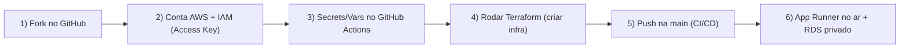
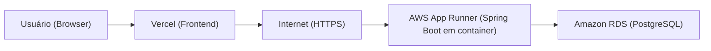
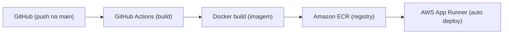
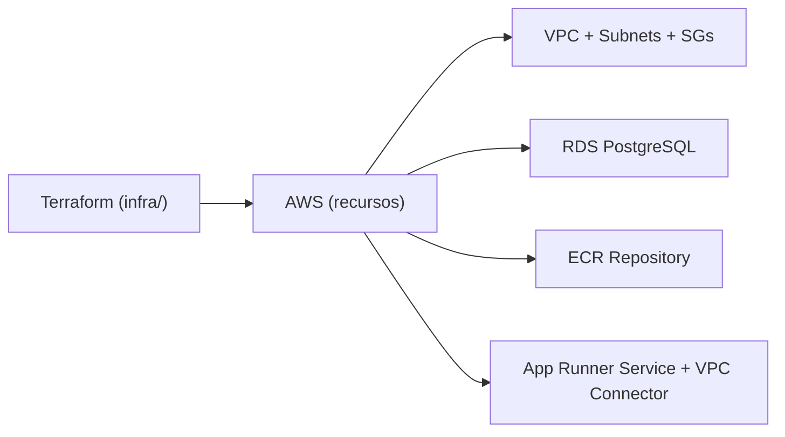

# ☁️ MeuSistema API — Backend Cloud Native (Java 17 + Spring Boot 3)


Este repositório é um **GUIA DE ESTUDOS** para uma aula de **Backend Cloud Native**: você vai aprender a transformar uma API Spring Boot em um serviço pronto para produção usando **container**, **autenticação JWT stateless**, **RDS PostgreSQL em subnets privadas** e **Terraform (IaC)** — com **CI/CD via GitHub Actions**.

> 🎯 Objetivo da aula: sair do “funciona na minha máquina” para “funciona na nuvem, de forma previsível, replicável e segura”.

---

## 🚦 Setup de Aula (Fork + AWS + GitHub Actions + Terraform)

Esta seção é o **passo a passo que seus alunos seguem do zero** até ter a API rodando na AWS com CI/CD.

### Por que **Fork** (e não só clone)?

Sim, é uma proposta totalmente válida (e recomendada) para uma aula prática.

- **Secrets não “viajam” com clone**: cada aluno precisa configurar `Secrets` e `Variables` no *repositório dele* (GitHub Actions).
- **Deploy precisa de credenciais próprias**: o pipeline vai publicar imagem no **ECR** e atualizar o **App Runner** na **conta AWS do aluno**.
- **Isolamento e segurança**: cada um testa, quebra e ajusta sem afetar o repositório da turma.

> Em resumo: **fork = laboratório individual com CI/CD funcionando**.

### Mapa do Setup (o que acontece na aula)



---

### 1) Faça o Fork e prepare o repositório do aluno

1. Abra o repositório original no GitHub.
2. Clique em **Fork** → escolha sua conta → crie o fork.
3. No fork, confirme que você tem acesso a **Actions** e **Settings**.

Opcional (mas recomendado): proteja a branch `main` e trabalhe por PRs em aula.

---

### 2) Crie uma conta AWS (e prepare segurança básica)

1. Crie uma conta em `https://aws.amazon.com/` (se ainda não tiver).
2. Ative **MFA** no root user (segurança mínima).
3. Evite usar root user no dia a dia: vamos usar **IAM**.

> 💰 Atenção de custos: RDS e App Runner podem gerar cobrança. Ao final da aula, execute `destroy` no Terraform.

---

### 3) Crie um usuário IAM para o GitHub Actions (Access Key ID + Secret)

No **AWS Console**:

1. Vá em **IAM** → **Users** → **Create user**
2. Nome sugestão: `github-actions-meusistema`
3. Marque acesso programático (Access Keys)
4. Permissões (para aula):
   - Opção simples: **AdministratorAccess** (fácil para aprender; depois remova)
   - Opção correta (produção): policy mínima (mais trabalho; ótimo tema para próxima aula)
5. Crie e **copie**:
   - `AWS_ACCESS_KEY_ID`
   - `AWS_SECRET_ACCESS_KEY`
     
  


Para pegar o **AWS Account ID**:

- No canto superior direito do console geralmente aparece o ID, ou
- Via CLI (depois de configurar credenciais): `aws sts get-caller-identity`

---

### 4) Configure Secrets e Variables no GitHub Actions (no fork do aluno)

No GitHub do *fork*: **Settings → Secrets and variables → Actions**

#### Secrets (valores sensíveis)

- `AWS_ACCESS_KEY_ID` → Access Key do IAM user
- `AWS_SECRET_ACCESS_KEY` → Secret Key do IAM user
- `AWS_ACCOUNT_ID` → ID da conta AWS (**opcional**: os workflows conseguem descobrir via `sts get-caller-identity`)
- `TF_DB_USER` → usuário do Postgres do RDS (ex.: `postgres`)
- `TF_DB_PASSWORD` → senha do Postgres do RDS (defina uma senha forte)
- `APP_RUNNER_SERVICE_ARN` → ARN do App Runner (**opcional**: o deploy tenta descobrir pelo nome do serviço; recomendado cadastrar para ficar explícito na aula)

#### Variables (valores não sensíveis)

- `AWS_REGION` → região (ex.: `us-east-1`)

> O pipeline de deploy usa `APP_RUNNER_SERVICE_ARN` para apontar o App Runner para a **nova imagem** no ECR.

---

### 5) Provisionando a infra com Terraform (GitHub Actions)

O workflow de infra é manual:

- arquivo: `.github/workflows/terraform.yml`
- modo: `workflow_dispatch`

Passo a passo:

1. Vá em **Actions** → **Provision Infrastructure**
2. Clique em **Run workflow**
3. Selecione `apply`

O workflow já faz o “primeiro deploy técnico” necessário para o App Runner não falhar na criação:

- cria o repositório no **ECR**
- faz **build e push de uma imagem `:latest`** (bootstrap)
- só então cria o **App Runner** apontando para `:latest`

Ao final, veja os **outputs** do Terraform no log do workflow:

- `app_runner_service_arn` → copie e cadastre como `APP_RUNNER_SERVICE_ARN` (Secrets)
- `rds_endpoint` → útil para debug
- `ecr_repository_url` → confirma onde a imagem será publicada

> Dica de aula: peça para os alunos colarem o `app_runner_service_arn` no Secret e, só então, fazerem um commit para disparar o deploy.

---

### 6) CI/CD: o primeiro deploy (GitHub → ECR → App Runner)

Agora o fluxo fica simples:

1. Faça um commit no fork (push na `main`)
2. O workflow `.github/workflows/deploy.yml`:
   - builda o JAR
   - builda a imagem Docker
   - publica no ECR
   - atualiza o App Runner para usar a nova imagem

O deploy tenta descobrir automaticamente o `APP_RUNNER_SERVICE_ARN` pelo nome do serviço (`meusistema-api`). Mesmo assim, em aula é comum cadastrar o ARN como Secret para deixar “à prova de bala”.

Se quiser validar:

- abra o endpoint do App Runner e teste `/health`

---

### 7) Terraform local (especialmente para quem usa Windows)

Rodar Terraform localmente é excelente para aprender **plan/apply/destroy** e entender o que o CI está fazendo.

#### Ferramentas locais (Windows / macOS / Linux)

Para rodar Terraform local e testar a AWS via CLI, você precisa de:

- **AWS CLI**
- **Terraform**

> Se você estiver no Windows, vamos usar **winget** para instalar tudo com comandos.

---

#### (Windows) Como instalar o winget (se não tiver)

O **winget** (Windows Package Manager) costuma vir por padrão no **Windows 10/11**.

1. Abra o PowerShell e teste:

```powershell
winget --version
```

2. Se não existir, instale o **App Installer**:
   - Microsoft Store → procure **App Installer** → Instalar
   - Depois reabra o terminal e teste `winget --version` novamente

---

#### Instalar Terraform

**Windows**

Escolha uma opção:

```powershell
# Opção 1) winget (Windows 10/11)
winget install HashiCorp.Terraform
```

```powershell
# Opção 2) Chocolatey
choco install terraform -y
```

```powershell
# Opção 3) Scoop
scoop install terraform
```

**macOS**

```bash
brew tap hashicorp/tap
brew install hashicorp/tap/terraform
terraform -v
```

**Linux (Ubuntu/Debian)**

```bash
sudo apt-get update
sudo apt-get install -y gnupg software-properties-common curl

curl -fsSL https://apt.releases.hashicorp.com/gpg | sudo gpg --dearmor -o /usr/share/keyrings/hashicorp-archive-keyring.gpg
echo "deb [signed-by=/usr/share/keyrings/hashicorp-archive-keyring.gpg] https://apt.releases.hashicorp.com $(lsb_release -cs) main" | sudo tee /etc/apt/sources.list.d/hashicorp.list

sudo apt-get update
sudo apt-get install -y terraform
terraform -v
```

Valide:

```powershell
terraform -v
```

> No macOS/Linux, valide também com `terraform -v`.

---

#### Instalar AWS CLI

**Windows**

```powershell
winget install Amazon.AWSCLI
aws --version
```

**macOS**

```bash
brew install awscli
aws --version
```

**Linux (Ubuntu/Debian)**

Opção simples (via apt):

```bash
sudo apt-get update
sudo apt-get install -y awscli
aws --version
```

> Em algumas distros, o `awscli` do repositório pode não ser a versão mais nova. Para produção, prefira o instalador oficial da AWS.

---

#### Configurar credenciais no seu SO (variáveis de ambiente)

**Windows (PowerShell — sessão atual):**

```powershell
$env:AWS_ACCESS_KEY_ID="SEU_ACCESS_KEY"
$env:AWS_SECRET_ACCESS_KEY="SEU_SECRET_KEY"
$env:AWS_REGION="us-east-1"
```

Ou configure de forma persistente com:

```powershell
aws configure
```

**macOS/Linux (bash/zsh — sessão atual):**

```bash
export AWS_ACCESS_KEY_ID="SEU_ACCESS_KEY"
export AWS_SECRET_ACCESS_KEY="SEU_SECRET_KEY"
export AWS_REGION="us-east-1"
```

Ou configure de forma persistente com:

```bash
aws configure
```

#### Passar variáveis do Terraform (db user/senha)

Você tem duas formas (ensino recomendável: `terraform.tfvars`).

**Opção A — `terraform.tfvars` (recomendado):**

Crie `backend-meusistema/api/infra/terraform.tfvars`:

```hcl
db_username = "postgres"
db_password = "SENHA_FORTE_AQUI"
aws_region  = "us-east-1"
```

**Opção B — env vars (útil em CI):**

```powershell
$env:TF_VAR_db_username="postgres"
$env:TF_VAR_db_password="SENHA_FORTE_AQUI"
$env:TF_VAR_aws_region="us-east-1"
```

No macOS/Linux:

```bash
export TF_VAR_db_username="postgres"
export TF_VAR_db_password="SENHA_FORTE_AQUI"
export TF_VAR_aws_region="us-east-1"
```

#### Rodar Terraform local (plan/apply/destroy)

**Windows (PowerShell):**

```powershell
cd backend-meusistema/api/infra

terraform init
terraform plan
terraform apply
```

**macOS/Linux (bash/zsh):**

```bash
cd backend-meusistema/api/infra

terraform init
terraform plan
terraform apply
```

Para destruir (final da aula):

```bash
terraform destroy
```

> ⚠️ Importante: `destroy` evita custo contínuo do RDS/App Runner.

---

## 🧨 Encerramento da Aula: `destroy` (parar cobrança) + limpeza final

Se você não destruir a infraestrutura, o AWS vai continuar mantendo os recursos **ligados** — e isso pode gerar **cobrança recorrente** (principalmente **RDS**).

### O que acontece com a cobrança depois do `destroy`?

- **Recursos destruídos deixam de ser cobrados** (por exemplo: instância do RDS e serviço do App Runner).
- **O que pode continuar gerando custo** é qualquer coisa que **não foi destruída** (ex.: snapshots/backups, logs, imagens em registry, etc.).

> ✅ Neste laboratório, o Terraform foi configurado para facilitar a desmontagem (ex.: `skip_final_snapshot = true` no RDS). Ainda assim, é sua responsabilidade validar no Console que tudo foi removido.

### Passo a passo (recomendado): destruir pela GitHub Actions

1. No seu **fork**, abra **Actions** → **Provision Infrastructure**
2. Clique em **Run workflow**
3. Selecione `destroy`
4. Aguarde o workflow finalizar

Depois, valide no AWS Console (5 minutos de checagem que podem economizar dinheiro):

- **RDS** → Databases → confirme que o DB `${project_name}-db` não existe mais
- **App Runner** → Services → confirme que o serviço `meusistema-api` não existe mais
- **ECR** → Repositories → confirme que o repositório `meusistema-api` não existe mais
- **VPC** → Your VPCs/Subnets/Security Groups → confirme que recursos da VPC do laboratório foram removidos

### Passo a passo (alternativo): destruir localmente via Terraform

```powershell
cd backend-meusistema/api/infra
terraform destroy
```

Se você usa `terraform.tfvars`, não precisa exportar `TF_VAR_*` de novo (o Terraform lê automaticamente).

### Se o `destroy` falhar: a causa mais comum (ECR com imagens)

Por padrão, o ECR pode impedir a remoção do repositório se ainda houver imagens.

Sintoma:

- erro ao destruir `aws_ecr_repository` dizendo que o repositório não está vazio

Neste laboratório, o Terraform define `force_delete = true` no ECR para facilitar o `destroy` mesmo com imagens.
Se ainda assim houver falha (permissões/estado antigo), siga a limpeza manual abaixo.

Como resolver:

1. AWS Console → **ECR** → Repositories → `meusistema-api`
2. Delete todas as imagens (tags `latest`, hashes, etc.)
3. Rode o `destroy` novamente

> Dica de arquiteto: em projetos de aula/lab, é comum habilitar “force delete” do repositório. Em produção, isso deve ser bem pensado (política de retenção, auditoria, rollback).

### Limpeza extra (recomendado para aula)

- **Revogue as credenciais IAM** criadas para a aula:
  - IAM → Users → `github-actions-meusistema` → Security credentials → Delete/Deactivate Access Keys
  - (opcional) Delete o usuário IAM inteiro após a aula
- **Remova Secrets** do GitHub no fork do aluno (ou delete o fork).

---

## 💸 Custos: como a AWS cobra (e como simular antes da aula)

Não dá para fixar valores aqui porque preços variam por **região**, **data** e **tabela vigente**. Mas dá para ensinar (e simular) de forma objetiva.

> Referência desta aula (região + câmbio): **us-east-1 (N. Virginia)** e **US$ 1 = R$ 5,402856** (atualização do provedor: **2025-12-13 00:02 UTC**).  
> Use como conversão rápida: `custo_em_BRL = custo_em_USD * 5,402856`.

### Como “pensar custo” (modelo mental)

Em cloud, o custo normalmente nasce de 4 coisas:

1. **Tempo ligado** (ex.: “por hora”)
2. **Capacidade** (ex.: vCPU/memória, classe do banco)
3. **Armazenamento** (GB/mês)
4. **Transferência de dados** (GB saindo/entrando, requests)

### O que o nosso laboratório cria (e onde costuma custar)

#### 1) Amazon RDS (PostgreSQL) — normalmente o maior custo do lab

Você paga por:

- **DB instance-hours** (classe `db.t3.micro`, enquanto existir)
- **Storage** (ex.: 20GB alocados no Terraform)
- (dependendo da configuração) **backups/snapshots** e I/O

Como “simular”:

- Custo aproximado do RDS ≈ `horas_ligado * preço_por_hora_da_classe + GB_storage * preço_por_GB_mês`

#### 2) AWS App Runner — custo por uso de compute do serviço

Você paga por:

- **Compute do serviço** (vCPU + memória) enquanto o serviço está rodando e recebendo tráfego
- **Requests** e/ou componentes de rede (dependendo de configuração)

Como “simular”:

- Custo aproximado do App Runner ≈ `horas_ligado * (vCPU_rate + memory_rate) + requests_rate`

> Observação didática: em ambientes com pouca carga, o custo pode ser baixo, mas deixar “rodando a semana toda” muda o jogo.

#### 3) Amazon ECR — storage do registry de imagens

Você paga por:

- **Armazenamento das imagens** (GB/mês)
- Em alguns cenários, **data transfer** ao puxar imagens (varia por arquitetura/região)

Como “simular”:

- Custo aproximado do ECR ≈ `GB_imagens * preço_por_GB_mês`

#### 4) VPC, Subnets, Security Groups, Internet Gateway

Em geral:

- **VPC/Subnet/Security Group/IGW** não são os maiores custos (muitos desses são “sem custo direto”)
- O que costuma encarecer redes é **NAT Gateway** (não usamos neste lab)

> Isso é um ponto didático ótimo: “rede bem desenhada sem NAT” pode reduzir custo — mas também tem trade-offs.

#### 5) CloudWatch Logs/Metrics (pode aparecer)

Mesmo sem configurar explicitamente, serviços podem gerar logs/métricas.

- Em geral é baixo em aula, mas é bom ensinar o aluno a olhar no **Cost Explorer**.

---

### Simulação prática (passo a passo com a AWS Pricing Calculator — us-east-1)

1. Abra a **AWS Pricing Calculator** (pesquise por “AWS Pricing Calculator” no Google).
2. Selecione a **região** usada na aula: `us-east-1 (N. Virginia)`.
3. Adicione estimativas:

**RDS PostgreSQL**
- Engine: PostgreSQL
- Classe: `db.t3.micro`
- Storage: `20 GB`
- Tempo ligado: você pode estimar por “mês” e depois converter para horas da aula (abaixo).

**App Runner**
- vCPU/memória conforme configuração do serviço
- Tempo ligado: idem (mês → horas)
- Requests: estimativa (poucas chamadas em aula geralmente)

**ECR**
- Armazenamento: estimativa do tamanho da imagem * quantidade de tags (ex.: `latest` + alguns commits)

4. Gere o total e discuta em aula:

- “Quanto custa se eu esquecer ligado por 7 dias?”
- “Quanto custa se eu destruir no final da aula?”

> ✅ Didática sugerida: faça os alunos simularem **2 cenários**: (A) só durante a aula, (B) uma semana ligada. A diferença fixa a importância do `destroy`.

#### Convertendo “custo mensal” em “custo da aula” (fórmula prática)

Quase sempre a calculadora entrega um **total mensal**. Para trazer para a realidade da aula:

- Considere `730 horas/mês` (aproximação padrão)
- `custo_hora_USD = custo_mensal_USD / 730`
- `custo_aula_USD = custo_hora_USD * horas_da_aula`
- `custo_aula_BRL = custo_aula_USD * 5,402856`

Exemplo didático (números ilustrativos):

- Se a calculadora indicar `US$ 25,00/mês` para o conjunto (RDS + App Runner + ECR + logs)
- `custo_hora ≈ 25/730 = US$ 0,034`
- Aula de 4h: `0,034 * 4 = US$ 0,136`
- Em reais: `0,136 * 5,402856 ≈ R$ 0,73`

Agora compare com “esqueci ligado 7 dias”:

- 7 dias = 168h
- `0,034 * 168 = US$ 5,71` → `≈ R$ 30,85`

> O valor real vai depender do que você configurou na calculadora, mas o **impacto do tempo ligado** sempre aparece — e é isso que a aula precisa fixar.

---

## 🗺️ O Mapa da Nuvem (Arquitetura AWS)

### 1) Caminho de execução (runtime): Frontend → API → Banco



**O que isso significa na prática**

- **Vercel (Frontend)** entrega arquivos estáticos via CDN e chama a API via HTTPS.
- **AWS App Runner** executa o container do Spring Boot (porta `8080`) e expõe um endpoint público.
- **Amazon RDS (PostgreSQL)** roda em **subnets privadas** e **não é acessível publicamente**: apenas a aplicação, via VPC, consegue conectar.

### 2) Caminho de entrega (CI/CD): GitHub → ECR → App Runner



**Por que isso é “Cloud Native”?**

- A unidade de deploy é a **imagem Docker**, não a sua máquina.
- O App Runner faz o papel de **plataforma**: roda, monitora e escala o serviço.
- O CI/CD automatiza build + publish + deploy para evitar “deploy manual” (erro humano).

### 3) Terraform como “criador da nuvem” (IaC)



Terraform é o **código** que descreve e cria a infraestrutura. Ele transforma “cliques” em um **projeto versionado**, auditável e reprodutível.

---

## 🧠 Deep Dive no Código (Explicação Técnica)

### 1) 🔐 Segurança (Spring Security): CORS + JWT Stateless

Arquivos-chave:

- `src/main/java/br/com/meusistema/api/config/SecurityConfig.java`
- `src/main/java/br/com/meusistema/api/config/JwtAuthenticationFilter.java`
- `src/main/java/br/com/meusistema/api/service/JwtService.java`

#### (A) O que é CORS e por que liberar a Vercel?

**CORS (Cross-Origin Resource Sharing)** é a política do navegador que bloqueia chamadas HTTP entre origens diferentes por padrão.

- Origem do frontend (ex.: `https://...vercel.app`)
- Origem do backend (ex.: `https://...awsapprunner.com`)

Quando o browser tenta chamar a API, ele faz:

1. **Preflight** (`OPTIONS`) para perguntar “posso chamar?”
2. Se a API responder com headers de CORS corretos, a chamada real acontece (`GET/POST/...`)

No `SecurityConfig`, o backend permite explicitamente origens confiáveis:

- `http://localhost:5173` (Vite)
- `http://localhost:3000` (alternativo)
- `https://meusistema-fullstack-programaai.vercel.app` (Vercel)

> ✅ Regra de ouro: CORS é uma proteção do **browser** (UX + segurança). Não substitui autenticação/autorização no backend.

#### (B) Stateless: por que desabilitar sessão?

No `SecurityConfig`, existe:

- `SessionCreationPolicy.STATELESS`

Isso diz: **não guardar sessão no servidor**. Em vez disso:

- Cada request envia um **JWT** no header `Authorization: Bearer <token>`
- O backend valida o token e decide se autoriza

Vantagens (aula de cloud):

- Facilita **escala horizontal** (mais instâncias sem “compartilhar sessão”)
- Simplifica deploy (menos estado no servidor)
- Ajuda em ambientes com auto-scaling

#### (C) O filtro JWT: como os endpoints ficam protegidos?

O `JwtAuthenticationFilter` roda **antes** do `UsernamePasswordAuthenticationFilter`:

- Lê o header `Authorization`
- Se não tiver token, deixa seguir (o SecurityConfig bloqueará as rotas privadas)
- Se tiver `Bearer ...`, extrai o username (`sub`) e valida assinatura/expiração
- Se válido, monta um `UsernamePasswordAuthenticationToken` e coloca no `SecurityContext`

> ✅ Resultado: controllers/services conseguem acessar o usuário autenticado via `SecurityContextHolder`.

Rotas públicas liberadas (sem autenticação):

- `POST /auth/login`
- `POST /auth/register`
- `GET /health`
- Swagger (rotas liberadas para docs): `/v3/api-docs/**`, `/swagger-ui/**`, `/swagger-ui.html`

#### (D) Onde nasce o token?

No `JwtService`, o token é assinado com `HS256` e expira em **10 horas**:

- `SECRET_KEY` é lida de variável de ambiente (`@Value("${SECRET_KEY}")`)
- Em produção, essa chave **não deve** ficar no código — deve estar em **Secrets/Env Vars**

> 🛡️ Para a aula: mantenha simples para entender o fluxo. Para produção: rotacionar segredo, usar Secrets Manager, e observar tamanho mínimo de chave para HMAC.

---

### 2) 🧱 Padrão DTO: por que usar `FornecedorResponseDTO` e amigos?

Arquivos-chave:

- `src/main/java/br/com/meusistema/api/dtos/FornecedorResponseDTO.java`
- `src/main/java/br/com/meusistema/api/dtos/*`
- `src/main/java/br/com/meusistema/api/mapper/*`

DTOs (Data Transfer Objects) existem para **separar**:

- **Modelo de domínio / banco** (`model/` + entidades JPA)
- **Contrato da API** (o JSON que o frontend consome)

Exemplo real do projeto (Java `record`):

```java
public record FornecedorResponseDTO(
  Long id,
  String nomeFantasia,
  String email,
  String cnpj,
  TipoFornecedorEnum tipoFornecedor,
  EnderecoDTO endereco
) {}
```

#### Por que isso é importante em projetos reais?

- **Desacoplamento**: você pode mudar a entidade (banco) sem quebrar o frontend.
- **Segurança**: evita expor campos sensíveis (ex.: `senha`, flags internas).
- **Evolução**: versionamento e mudanças controladas no contrato (o “produto” da API).
- **Performance**: evita serializar grafos JPA gigantes (lazy-loading, ciclos, N+1).

#### E como esses DTOs viram entidade e vice-versa?

O projeto usa **MapStruct** (vide dependências no `pom.xml`) para mapear automaticamente:

- `ClienteMapper`, `FornecedorMapper`, `ProdutoMapper`

Isso cria um “pipeline” limpo:

`Controller` → `DTO` → `Service` → `Entity` → `Repository` → `Entity` → `DTO` → `Controller`

---

### 3) 🧯 Global Exception Handler: erros Java → JSON amigável

Arquivos-chave:

- `src/main/java/br/com/meusistema/api/exception/GlobalExceptionHandler.java`
- `src/main/java/br/com/meusistema/api/exception/StandardError.java`

Em APIs, o frontend precisa receber erros **consistentes**. Em vez de:

- stacktrace
- mensagens aleatórias
- 500 genérico sem contexto

O `@ControllerAdvice` centraliza a tradução de exceções em um payload padrão:

```json
{
  "timestamp": "2025-12-13T12:34:56Z",
  "status": 404,
  "error": "Recurso não encontrado",
  "message": "Cliente não encontrado",
  "path": "/clientes/999"
}
```

Casos tratados no projeto:

- `EntityNotFoundException` → `404`
- `MethodArgumentNotValidException` (validação `@Valid`) → `400` (mensagem de campo)
- `AccessDeniedException` → `403`
- `BadCredentialsException` → `401`
- `Exception` genérica → `500` com mensagem amigável

> ✅ Resultado: o frontend pode exibir mensagens claras (e.g. Toast) sem “adivinhar” o erro.

---

## ☁️ Cloud & DevOps (A Aula de Deploy)

### 1) AWS App Runner (por que container?)

O **AWS App Runner** é uma plataforma gerenciada para rodar serviços web containerizados.

No nosso projeto:

- O build gera uma **imagem Docker**
- A imagem é publicada no **Amazon ECR**
- O App Runner executa essa imagem e expõe um endpoint HTTPS

#### Por que usar container?

- **Ambiente reprodutível**: “mesmo artefato” em dev/staging/prod.
- **Isolamento**: dependências ficam dentro da imagem.
- **Portabilidade**: roda em qualquer runtime compatível com container.

#### O que é Auto-scaling?

É a capacidade de aumentar/diminuir instâncias automaticamente conforme demanda.

Em termos de aula:

- 1 instância → tráfego baixo
- mais instâncias → tráfego alto
- menos instâncias → economia

> Observação: os detalhes de escala (concurrency, min/max, métricas) são configuráveis no App Runner; aqui focamos no essencial: **serviço gerenciado + deploy por imagem**.

#### Como o App Runner acessa o banco privado (RDS)?

Usamos um **VPC Connector** apontando para subnets privadas. Isso permite que o serviço faça conexões de saída para recursos dentro da VPC (como o RDS).

No Terraform: `aws_apprunner_vpc_connector`.

---

### 2) Amazon RDS (PostgreSQL) — banco gerenciado, rede privada

O **RDS** cuida de:

- Provisionamento do Postgres
- Patch/upgrade (conforme política)
- Backups (se habilitado)
- Observabilidade (métricas, logs)

No nosso Terraform, o RDS:

- roda com engine `postgres` versão `16.4`
- fica em **subnets privadas** (`publicly_accessible = false`)
- só aceita conexão na porta `5432` vinda do security group da aplicação

Isso implementa o princípio: **Banco não fica exposto na internet.**

---

### 3) Terraform (IaC) — Infraestrutura como Código, do zero ao deploy

#### O que é IaC?

**Infrastructure as Code** significa declarar a infraestrutura como arquivos versionados:

- você “desenha” a infra no Git
- revisa em PR
- aplica em ambientes consistentes

Ganhos:

- **Repetibilidade**: recriar do zero sem esquecer passos
- **Auditabilidade**: histórico do que mudou e por quê
- **Automação**: CI/CD pode provisionar e atualizar recursos

#### Pré-requisitos (para rodar Terraform)

- **Terraform CLI** (>= 1.5)
- **AWS CLI** configurado (`aws configure`) ou credenciais via env vars
- Permissão IAM para criar VPC, RDS, ECR, App Runner, IAM Role/Policy

Instalação (exemplos):

```bash
# macOS (Homebrew)
brew tap hashicorp/tap
brew install hashicorp/tap/terraform

# validar
terraform -v
```

#### O que o nosso Terraform cria? (explicando o `infra/main.tf` em detalhes)

> Pensa em camadas: **Rede → Segurança → Dados → Registry → Runtime → Outputs**

##### (1) Rede: VPC + Subnets + Internet Gateway + Rotas

Recursos:

- `aws_vpc.main`: rede privada `10.0.0.0/16`, com DNS habilitado (importante para resolução do endpoint do RDS).
- `aws_internet_gateway.igw`: dá saída para a internet **apenas** para subnets públicas.
- Subnets:
  - `aws_subnet.public_1`, `aws_subnet.public_2` (2 AZs)
  - `aws_subnet.private_1`, `aws_subnet.private_2` (2 AZs)
- `aws_route_table.public` + `aws_route_table_association.*`: rota `0.0.0.0/0` para o IGW nas subnets públicas.

Por que 2 AZs?

- Para aprender a ideia de **alta disponibilidade** (mesmo quando `multi_az = false` no RDS).
- Porque serviços como RDS Subnet Group pedem subnets em mais de uma AZ.

##### (2) Segurança: Security Groups “conversando” entre si

Recursos:

- `aws_security_group.app_sg`: security group da aplicação (egress liberado).
- `aws_security_group.db_sg`: security group do banco.

Regra crítica no `db_sg`:

- permite `tcp/5432` **somente** do `app_sg`

> ✅ Isso é “segurança por identidade”: não libera por IP; libera por *quem é o chamador* (SG).

##### (3) Dados: RDS em subnets privadas

Recursos:

- `aws_db_subnet_group.db_subnets`: define onde o banco pode ficar (subnets privadas).
- `aws_db_instance.postgres`: instância Postgres.

Configurações importantes do banco:

- `publicly_accessible = false` → não expõe IP público
- `skip_final_snapshot = true` → facilita destruir em laboratório/aula
- `backup_retention_period = 0` → sem retenção (aula)

> Para produção: habilite criptografia, snapshots finais e retenção de backup.

##### (4) Registry: ECR para armazenar imagens

Recurso:

- `aws_ecr_repository.app_repo`: repositório privado para imagens Docker.

Detalhes:

- `scan_on_push = true` → varredura de vulnerabilidade ao subir imagem.
- tag `latest` usada pelo App Runner (simples para aula).

##### (5) Permissões: IAM Role para o App Runner ler do ECR

Recursos:

- `aws_iam_role.apprunner_ecr_access`
- `aws_iam_role_policy_attachment.apprunner_ecr_access`

Isso dá ao App Runner a permissão de baixar imagens do ECR via policy AWS gerenciada:

- `AWSAppRunnerServicePolicyForECRAccess`

##### (6) Runtime: App Runner + VPC Connector + Env Vars

Recursos:

- `aws_apprunner_vpc_connector.app`:
  - aponta para `private_1` e `private_2`
  - usa `app_sg`
- `aws_apprunner_service.app`:
  - `auto_deployments_enabled = true`
  - imagem do ECR: `...:latest`
  - porta `8080`
  - injeta variáveis de ambiente do Spring:
    - `SPRING_DATASOURCE_URL`
    - `SPRING_DATASOURCE_USERNAME`
    - `SPRING_DATASOURCE_PASSWORD`
    - `SECRET_KEY`
  - configura egress via VPC Connector (para falar com o RDS privado)

> ✅ O App Runner recebe as configs do Spring via env vars (padrão 12-factor).

##### (7) Outputs: “o que você copia e cola”

Saídas úteis:

- URL do ECR (`ecr_repository_url`)
- endpoint do RDS (`rds_endpoint`)
- ARN do App Runner (`app_runner_service_arn`)

---

### 4) CI/CD (GitHub Actions) — do push ao deploy

#### Workflow de deploy: `.github/workflows/deploy.yml`

O que acontece quando você faz push na `main`:

1. Checkout do código
2. Setup Java 17
3. Build Maven (`./mvnw package`)
4. Login no ECR
5. Build da imagem Docker e push com:
   - tag do commit (`${GITHUB_SHA}`)
   - tag `latest`
6. Update do App Runner apontando para a nova imagem

Segredos necessários no GitHub:

- `AWS_ACCESS_KEY_ID`
- `AWS_SECRET_ACCESS_KEY`
- `AWS_ACCOUNT_ID`
- `APP_RUNNER_SERVICE_ARN`

#### Workflow de infra: `.github/workflows/terraform.yml`

Esse workflow é manual (`workflow_dispatch`) e aceita:

- `apply` → cria/atualiza a infra
- `destroy` → destrói a infra (cuidado!)

Segredos/vars recomendados:

- `AWS_ACCESS_KEY_ID`, `AWS_SECRET_ACCESS_KEY`
- `TF_DB_USER`, `TF_DB_PASSWORD` (para o RDS)
- `AWS_REGION` (vars)

> ⚠️ Nota didática sobre Terraform State: em projetos reais, o state deve ir para um backend remoto (S3 + DynamoDB). Aqui ele pode aparecer como artefato/arquivo para simplificar a aula.

---

## 🧪 Como Rodar Localmente (Spring Boot + Postgres)

### 1) Subindo um PostgreSQL local (Docker)

```bash
docker run --name meusistema-postgres \
  -e POSTGRES_DB=meu-sistema \
  -e POSTGRES_USER=postgres \
  -e POSTGRES_PASSWORD=123 \
  -p 5432:5432 \
  -d postgres:16
```

### 2) Configuração do `application.properties`

Arquivo: `src/main/resources/application.properties`

Ele já vem preparado para **sobrescrever por variável de ambiente** (ideal em cloud):

```properties
spring.datasource.url=${SPRING_DATASOURCE_URL:jdbc:postgresql://localhost:5432/meu-sistema}
spring.datasource.username=${SPRING_DATASOURCE_USERNAME:postgres}
spring.datasource.password=${SPRING_DATASOURCE_PASSWORD:123}
```

O que você precisa adicionar no ambiente local:

- `SECRET_KEY` (obrigatória para assinar/validar JWT)

Exemplo:

```bash
export SECRET_KEY="uma_chave_com_tamanho_suficiente_para_hmac_123456"
```

### 3) Comandos Maven

```bash
cd backend-meusistema/api

# build
./mvnw clean package

# rodar (opção A): via Spring Boot plugin
./mvnw spring-boot:run

# rodar (opção B): via JAR gerado
java -jar target/*.jar
```

### 4) Teste rápido (healthcheck)

```bash
curl http://localhost:8080/health
```

Resposta esperada:

```txt
Sistema rodando! Status: UP
```

---

## 📚 Swagger / OpenAPI (documentação da API)

O `SecurityConfig` já deixa rotas do Swagger liberadas:

- `/v3/api-docs/**`
- `/swagger-ui/**`

Se você quiser habilitar Swagger UI neste projeto, use a dependência SpringDoc (recomendado em aula):

```xml
<dependency>
  <groupId>org.springdoc</groupId>
  <artifactId>springdoc-openapi-starter-webmvc-ui</artifactId>
  <version>2.6.0</version>
</dependency>
```

Depois, rode a aplicação e acesse:

- `http://localhost:8080/swagger-ui/index.html`

---

## 🗂️ Arquitetura Organizacional (Pastas do Backend)

```txt
api/
├─ src/main/java/br/com/meusistema/api/
│  ├─ config/        # segurança (SecurityConfig, filtro JWT)
│  ├─ controller/    # camada HTTP (endpoints REST)
│  ├─ dtos/          # contratos da API (Request/Response)
│  ├─ exception/     # handler global e payload padrão de erro
│  ├─ mapper/        # MapStruct (DTO <-> Entity)
│  ├─ model/         # entidades JPA (domínio/banco)
│  ├─ repository/    # Spring Data JPA (persistência)
│  ├─ service/       # regras de negócio (casos de uso)
│  └─ MeuSistemaApplication.java
├─ src/main/resources/
│  └─ application.properties
├─ infra/
│  └─ main.tf        # Terraform (VPC, RDS, ECR, App Runner)
├─ .github/workflows/
│  ├─ deploy.yml     # CI/CD: build + docker + push + update App Runner
│  └─ terraform.yml  # IaC: apply/destroy da infra
└─ Dockerfile        # imagem do Spring Boot (multi-stage)
```

**Regra de bolso:**

- “É HTTP / endpoint?” → `controller/`
- “É regra de negócio?” → `service/`
- “É persistência?” → `repository/`
- “É contrato JSON?” → `dtos/`
- “É segurança?” → `config/`
- “É infra?” → `infra/` + workflows

---

## ✅ Checklist de estudos (para você dominar a aula)

- [ ] Explicar por que JWT + Stateless combina com auto-scaling
- [ ] Mostrar no `SecurityConfig` como o CORS libera a Vercel
- [ ] Explicar a ordem do filtro (`addFilterBefore`) e o `SecurityContext`
- [ ] Justificar DTOs e mostrar o `FornecedorResponseDTO`
- [ ] Mostrar o `GlobalExceptionHandler` e o JSON padronizado (`StandardError`)
- [ ] Explicar “Banco em subnet privada” e SG liberando só do `app_sg`
- [ ] Navegar no `infra/main.tf` por camadas (rede → segurança → dados → runtime)
- [ ] Explicar o pipeline `deploy.yml` (build → docker → ECR → App Runner)
