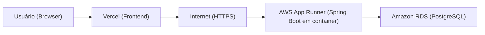
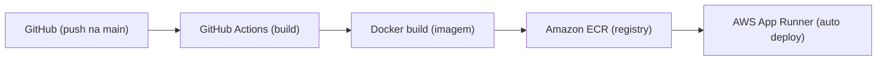
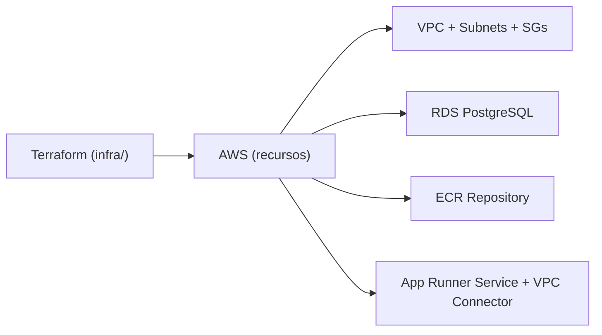

# ☁️ MeuSistema API — Backend Cloud Native (Java 17 + Spring Boot 3)


Este repositório é um **GUIA DE ESTUDOS** para uma aula de **Backend Cloud Native**: você vai aprender a transformar uma API Spring Boot em um serviço pronto para produção usando **container**, **autenticação JWT stateless**, **RDS PostgreSQL em subnets privadas** e **Terraform (IaC)** — com **CI/CD via GitHub Actions**.

> 🎯 Objetivo da aula: sair do “funciona na minha máquina” para “funciona na nuvem, de forma previsível, replicável e segura”.

---

## 🗺️ O Mapa da Nuvem (Arquitetura AWS)

### 1) Caminho de execução (runtime): Frontend → API → Banco



**O que isso significa na prática**

- **Vercel (Frontend)** entrega arquivos estáticos via CDN e chama a API via HTTPS.
- **AWS App Runner** executa o container do Spring Boot (porta `8080`) e expõe um endpoint público.
- **Amazon RDS (PostgreSQL)** roda em **subnets privadas** e **não é acessível publicamente**: apenas a aplicação, via VPC, consegue conectar.

### 2) Caminho de entrega (CI/CD): GitHub → ECR → App Runner



**Por que isso é “Cloud Native”?**

- A unidade de deploy é a **imagem Docker**, não a sua máquina.
- O App Runner faz o papel de **plataforma**: roda, monitora e escala o serviço.
- O CI/CD automatiza build + publish + deploy para evitar “deploy manual” (erro humano).

### 3) Terraform como “criador da nuvem” (IaC)



Terraform é o **código** que descreve e cria a infraestrutura. Ele transforma “cliques” em um **projeto versionado**, auditável e reprodutível.

---

## 🧠 Deep Dive no Código (Explicação Técnica)

### 1) 🔐 Segurança (Spring Security): CORS + JWT Stateless

Arquivos-chave:

- `src/main/java/br/com/meusistema/api/config/SecurityConfig.java`
- `src/main/java/br/com/meusistema/api/config/JwtAuthenticationFilter.java`
- `src/main/java/br/com/meusistema/api/service/JwtService.java`

#### (A) O que é CORS e por que liberar a Vercel?

**CORS (Cross-Origin Resource Sharing)** é a política do navegador que bloqueia chamadas HTTP entre origens diferentes por padrão.

- Origem do frontend (ex.: `https://...vercel.app`)
- Origem do backend (ex.: `https://...awsapprunner.com`)

Quando o browser tenta chamar a API, ele faz:

1. **Preflight** (`OPTIONS`) para perguntar “posso chamar?”
2. Se a API responder com headers de CORS corretos, a chamada real acontece (`GET/POST/...`)

No `SecurityConfig`, o backend permite explicitamente origens confiáveis:

- `http://localhost:5173` (Vite)
- `http://localhost:3000` (alternativo)
- `https://meusistema-fullstack-programaai.vercel.app` (Vercel)

> ✅ Regra de ouro: CORS é uma proteção do **browser** (UX + segurança). Não substitui autenticação/autorização no backend.

#### (B) Stateless: por que desabilitar sessão?

No `SecurityConfig`, existe:

- `SessionCreationPolicy.STATELESS`

Isso diz: **não guardar sessão no servidor**. Em vez disso:

- Cada request envia um **JWT** no header `Authorization: Bearer <token>`
- O backend valida o token e decide se autoriza

Vantagens (aula de cloud):

- Facilita **escala horizontal** (mais instâncias sem “compartilhar sessão”)
- Simplifica deploy (menos estado no servidor)
- Ajuda em ambientes com auto-scaling

#### (C) O filtro JWT: como os endpoints ficam protegidos?

O `JwtAuthenticationFilter` roda **antes** do `UsernamePasswordAuthenticationFilter`:

- Lê o header `Authorization`
- Se não tiver token, deixa seguir (o SecurityConfig bloqueará as rotas privadas)
- Se tiver `Bearer ...`, extrai o username (`sub`) e valida assinatura/expiração
- Se válido, monta um `UsernamePasswordAuthenticationToken` e coloca no `SecurityContext`

> ✅ Resultado: controllers/services conseguem acessar o usuário autenticado via `SecurityContextHolder`.

Rotas públicas liberadas (sem autenticação):

- `POST /auth/login`
- `POST /auth/register`
- `GET /health`
- Swagger (rotas liberadas para docs): `/v3/api-docs/**`, `/swagger-ui/**`, `/swagger-ui.html`

#### (D) Onde nasce o token?

No `JwtService`, o token é assinado com `HS256` e expira em **10 horas**:

- `SECRET_KEY` é lida de variável de ambiente (`@Value("${SECRET_KEY}")`)
- Em produção, essa chave **não deve** ficar no código — deve estar em **Secrets/Env Vars**

> 🛡️ Para a aula: mantenha simples para entender o fluxo. Para produção: rotacionar segredo, usar Secrets Manager, e observar tamanho mínimo de chave para HMAC.

---

### 2) 🧱 Padrão DTO: por que usar `FornecedorResponseDTO` e amigos?

Arquivos-chave:

- `src/main/java/br/com/meusistema/api/dtos/FornecedorResponseDTO.java`
- `src/main/java/br/com/meusistema/api/dtos/*`
- `src/main/java/br/com/meusistema/api/mapper/*`

DTOs (Data Transfer Objects) existem para **separar**:

- **Modelo de domínio / banco** (`model/` + entidades JPA)
- **Contrato da API** (o JSON que o frontend consome)

Exemplo real do projeto (Java `record`):

```java
public record FornecedorResponseDTO(
  Long id,
  String nomeFantasia,
  String email,
  String cnpj,
  TipoFornecedorEnum tipoFornecedor,
  EnderecoDTO endereco
) {}
```

#### Por que isso é importante em projetos reais?

- **Desacoplamento**: você pode mudar a entidade (banco) sem quebrar o frontend.
- **Segurança**: evita expor campos sensíveis (ex.: `senha`, flags internas).
- **Evolução**: versionamento e mudanças controladas no contrato (o “produto” da API).
- **Performance**: evita serializar grafos JPA gigantes (lazy-loading, ciclos, N+1).

#### E como esses DTOs viram entidade e vice-versa?

O projeto usa **MapStruct** (vide dependências no `pom.xml`) para mapear automaticamente:

- `ClienteMapper`, `FornecedorMapper`, `ProdutoMapper`

Isso cria um “pipeline” limpo:

`Controller` → `DTO` → `Service` → `Entity` → `Repository` → `Entity` → `DTO` → `Controller`

---

### 3) 🧯 Global Exception Handler: erros Java → JSON amigável

Arquivos-chave:

- `src/main/java/br/com/meusistema/api/exception/GlobalExceptionHandler.java`
- `src/main/java/br/com/meusistema/api/exception/StandardError.java`

Em APIs, o frontend precisa receber erros **consistentes**. Em vez de:

- stacktrace
- mensagens aleatórias
- 500 genérico sem contexto

O `@ControllerAdvice` centraliza a tradução de exceções em um payload padrão:

```json
{
  "timestamp": "2025-12-13T12:34:56Z",
  "status": 404,
  "error": "Recurso não encontrado",
  "message": "Cliente não encontrado",
  "path": "/clientes/999"
}
```

Casos tratados no projeto:

- `EntityNotFoundException` → `404`
- `MethodArgumentNotValidException` (validação `@Valid`) → `400` (mensagem de campo)
- `AccessDeniedException` → `403`
- `BadCredentialsException` → `401`
- `Exception` genérica → `500` com mensagem amigável

> ✅ Resultado: o frontend pode exibir mensagens claras (e.g. Toast) sem “adivinhar” o erro.

---

## ☁️ Cloud & DevOps (A Aula de Deploy)

### 1) AWS App Runner (por que container?)

O **AWS App Runner** é uma plataforma gerenciada para rodar serviços web containerizados.

No nosso projeto:

- O build gera uma **imagem Docker**
- A imagem é publicada no **Amazon ECR**
- O App Runner executa essa imagem e expõe um endpoint HTTPS

#### Por que usar container?

- **Ambiente reprodutível**: “mesmo artefato” em dev/staging/prod.
- **Isolamento**: dependências ficam dentro da imagem.
- **Portabilidade**: roda em qualquer runtime compatível com container.

#### O que é Auto-scaling?

É a capacidade de aumentar/diminuir instâncias automaticamente conforme demanda.

Em termos de aula:

- 1 instância → tráfego baixo
- mais instâncias → tráfego alto
- menos instâncias → economia

> Observação: os detalhes de escala (concurrency, min/max, métricas) são configuráveis no App Runner; aqui focamos no essencial: **serviço gerenciado + deploy por imagem**.

#### Como o App Runner acessa o banco privado (RDS)?

Usamos um **VPC Connector** apontando para subnets privadas. Isso permite que o serviço faça conexões de saída para recursos dentro da VPC (como o RDS).

No Terraform: `aws_apprunner_vpc_connector`.

---

### 2) Amazon RDS (PostgreSQL) — banco gerenciado, rede privada

O **RDS** cuida de:

- Provisionamento do Postgres
- Patch/upgrade (conforme política)
- Backups (se habilitado)
- Observabilidade (métricas, logs)

No nosso Terraform, o RDS:

- roda com engine `postgres` versão `16.4`
- fica em **subnets privadas** (`publicly_accessible = false`)
- só aceita conexão na porta `5432` vinda do security group da aplicação

Isso implementa o princípio: **Banco não fica exposto na internet.**

---

### 3) Terraform (IaC) — Infraestrutura como Código, do zero ao deploy

#### O que é IaC?

**Infrastructure as Code** significa declarar a infraestrutura como arquivos versionados:

- você “desenha” a infra no Git
- revisa em PR
- aplica em ambientes consistentes

Ganhos:

- **Repetibilidade**: recriar do zero sem esquecer passos
- **Auditabilidade**: histórico do que mudou e por quê
- **Automação**: CI/CD pode provisionar e atualizar recursos

#### Pré-requisitos (para rodar Terraform)

- **Terraform CLI** (>= 1.5)
- **AWS CLI** configurado (`aws configure`) ou credenciais via env vars
- Permissão IAM para criar VPC, RDS, ECR, App Runner, IAM Role/Policy

Instalação (exemplos):

```bash
# macOS (Homebrew)
brew tap hashicorp/tap
brew install hashicorp/tap/terraform

# validar
terraform -v
```

#### O que o nosso Terraform cria? (explicando o `infra/main.tf` em detalhes)

> Pensa em camadas: **Rede → Segurança → Dados → Registry → Runtime → Outputs**

##### (1) Rede: VPC + Subnets + Internet Gateway + Rotas

Recursos:

- `aws_vpc.main`: rede privada `10.0.0.0/16`, com DNS habilitado (importante para resolução do endpoint do RDS).
- `aws_internet_gateway.igw`: dá saída para a internet **apenas** para subnets públicas.
- Subnets:
  - `aws_subnet.public_1`, `aws_subnet.public_2` (2 AZs)
  - `aws_subnet.private_1`, `aws_subnet.private_2` (2 AZs)
- `aws_route_table.public` + `aws_route_table_association.*`: rota `0.0.0.0/0` para o IGW nas subnets públicas.

Por que 2 AZs?

- Para aprender a ideia de **alta disponibilidade** (mesmo quando `multi_az = false` no RDS).
- Porque serviços como RDS Subnet Group pedem subnets em mais de uma AZ.

##### (2) Segurança: Security Groups “conversando” entre si

Recursos:

- `aws_security_group.app_sg`: security group da aplicação (egress liberado).
- `aws_security_group.db_sg`: security group do banco.

Regra crítica no `db_sg`:

- permite `tcp/5432` **somente** do `app_sg`

> ✅ Isso é “segurança por identidade”: não libera por IP; libera por *quem é o chamador* (SG).

##### (3) Dados: RDS em subnets privadas

Recursos:

- `aws_db_subnet_group.db_subnets`: define onde o banco pode ficar (subnets privadas).
- `aws_db_instance.postgres`: instância Postgres.

Configurações importantes do banco:

- `publicly_accessible = false` → não expõe IP público
- `skip_final_snapshot = true` → facilita destruir em laboratório/aula
- `backup_retention_period = 0` → sem retenção (aula)

> Para produção: habilite criptografia, snapshots finais e retenção de backup.

##### (4) Registry: ECR para armazenar imagens

Recurso:

- `aws_ecr_repository.app_repo`: repositório privado para imagens Docker.

Detalhes:

- `scan_on_push = true` → varredura de vulnerabilidade ao subir imagem.
- tag `latest` usada pelo App Runner (simples para aula).

##### (5) Permissões: IAM Role para o App Runner ler do ECR

Recursos:

- `aws_iam_role.apprunner_ecr_access`
- `aws_iam_role_policy_attachment.apprunner_ecr_access`

Isso dá ao App Runner a permissão de baixar imagens do ECR via policy AWS gerenciada:

- `AWSAppRunnerServicePolicyForECRAccess`

##### (6) Runtime: App Runner + VPC Connector + Env Vars

Recursos:

- `aws_apprunner_vpc_connector.app`:
  - aponta para `private_1` e `private_2`
  - usa `app_sg`
- `aws_apprunner_service.app`:
  - `auto_deployments_enabled = true`
  - imagem do ECR: `...:latest`
  - porta `8080`
  - injeta variáveis de ambiente do Spring:
    - `SPRING_DATASOURCE_URL`
    - `SPRING_DATASOURCE_USERNAME`
    - `SPRING_DATASOURCE_PASSWORD`
    - `SECRET_KEY`
  - configura egress via VPC Connector (para falar com o RDS privado)

> ✅ O App Runner recebe as configs do Spring via env vars (padrão 12-factor).

##### (7) Outputs: “o que você copia e cola”

Saídas úteis:

- URL do ECR (`ecr_repository_url`)
- endpoint do RDS (`rds_endpoint`)
- ARN do App Runner (`app_runner_service_arn`)

---

### 4) CI/CD (GitHub Actions) — do push ao deploy

#### Workflow de deploy: `.github/workflows/deploy.yml`

O que acontece quando você faz push na `main`:

1. Checkout do código
2. Setup Java 17
3. Build Maven (`./mvnw package`)
4. Login no ECR
5. Build da imagem Docker e push com:
   - tag do commit (`${GITHUB_SHA}`)
   - tag `latest`
6. Update do App Runner apontando para a nova imagem

Segredos necessários no GitHub:

- `AWS_ACCESS_KEY_ID`
- `AWS_SECRET_ACCESS_KEY`
- `AWS_ACCOUNT_ID`
- `APP_RUNNER_SERVICE_ARN`

#### Workflow de infra: `.github/workflows/terraform.yml`

Esse workflow é manual (`workflow_dispatch`) e aceita:

- `apply` → cria/atualiza a infra
- `destroy` → destrói a infra (cuidado!)

Segredos/vars recomendados:

- `AWS_ACCESS_KEY_ID`, `AWS_SECRET_ACCESS_KEY`
- `TF_DB_USER`, `TF_DB_PASSWORD` (para o RDS)
- `AWS_REGION` (vars)

> ⚠️ Nota didática sobre Terraform State: em projetos reais, o state deve ir para um backend remoto (S3 + DynamoDB). Aqui ele pode aparecer como artefato/arquivo para simplificar a aula.

---

## 🧪 Como Rodar Localmente (Spring Boot + Postgres)

### 1) Subindo um PostgreSQL local (Docker)

```bash
docker run --name meusistema-postgres \
  -e POSTGRES_DB=meu-sistema \
  -e POSTGRES_USER=postgres \
  -e POSTGRES_PASSWORD=123 \
  -p 5432:5432 \
  -d postgres:16
```

### 2) Configuração do `application.properties`

Arquivo: `src/main/resources/application.properties`

Ele já vem preparado para **sobrescrever por variável de ambiente** (ideal em cloud):

```properties
spring.datasource.url=${SPRING_DATASOURCE_URL:jdbc:postgresql://localhost:5432/meu-sistema}
spring.datasource.username=${SPRING_DATASOURCE_USERNAME:postgres}
spring.datasource.password=${SPRING_DATASOURCE_PASSWORD:123}
```

O que você precisa adicionar no ambiente local:

- `SECRET_KEY` (obrigatória para assinar/validar JWT)

Exemplo:

```bash
export SECRET_KEY="uma_chave_com_tamanho_suficiente_para_hmac_123456"
```

### 3) Comandos Maven

```bash
cd backend-meusistema/api

# build
./mvnw clean package

# rodar (opção A): via Spring Boot plugin
./mvnw spring-boot:run

# rodar (opção B): via JAR gerado
java -jar target/*.jar
```

### 4) Teste rápido (healthcheck)

```bash
curl http://localhost:8080/health
```

Resposta esperada:

```txt
Sistema rodando! Status: UP
```

---

## 📚 Swagger / OpenAPI (documentação da API)

O `SecurityConfig` já deixa rotas do Swagger liberadas:

- `/v3/api-docs/**`
- `/swagger-ui/**`

Se você quiser habilitar Swagger UI neste projeto, use a dependência SpringDoc (recomendado em aula):

```xml
<dependency>
  <groupId>org.springdoc</groupId>
  <artifactId>springdoc-openapi-starter-webmvc-ui</artifactId>
  <version>2.6.0</version>
</dependency>
```

Depois, rode a aplicação e acesse:

- `http://localhost:8080/swagger-ui/index.html`

---

## 🗂️ Arquitetura Organizacional (Pastas do Backend)

```txt
api/
├─ src/main/java/br/com/meusistema/api/
│  ├─ config/        # segurança (SecurityConfig, filtro JWT)
│  ├─ controller/    # camada HTTP (endpoints REST)
│  ├─ dtos/          # contratos da API (Request/Response)
│  ├─ exception/     # handler global e payload padrão de erro
│  ├─ mapper/        # MapStruct (DTO <-> Entity)
│  ├─ model/         # entidades JPA (domínio/banco)
│  ├─ repository/    # Spring Data JPA (persistência)
│  ├─ service/       # regras de negócio (casos de uso)
│  └─ MeuSistemaApplication.java
├─ src/main/resources/
│  └─ application.properties
├─ infra/
│  └─ main.tf        # Terraform (VPC, RDS, ECR, App Runner)
├─ .github/workflows/
│  ├─ deploy.yml     # CI/CD: build + docker + push + update App Runner
│  └─ terraform.yml  # IaC: apply/destroy da infra
└─ Dockerfile        # imagem do Spring Boot (multi-stage)
```

**Regra de bolso:**

- “É HTTP / endpoint?” → `controller/`
- “É regra de negócio?” → `service/`
- “É persistência?” → `repository/`
- “É contrato JSON?” → `dtos/`
- “É segurança?” → `config/`
- “É infra?” → `infra/` + workflows

---

## ✅ Checklist de estudos (para você dominar a aula)

- [ ] Explicar por que JWT + Stateless combina com auto-scaling
- [ ] Mostrar no `SecurityConfig` como o CORS libera a Vercel
- [ ] Explicar a ordem do filtro (`addFilterBefore`) e o `SecurityContext`
- [ ] Justificar DTOs e mostrar o `FornecedorResponseDTO`
- [ ] Mostrar o `GlobalExceptionHandler` e o JSON padronizado (`StandardError`)
- [ ] Explicar “Banco em subnet privada” e SG liberando só do `app_sg`
- [ ] Navegar no `infra/main.tf` por camadas (rede → segurança → dados → runtime)
- [ ] Explicar o pipeline `deploy.yml` (build → docker → ECR → App Runner)

